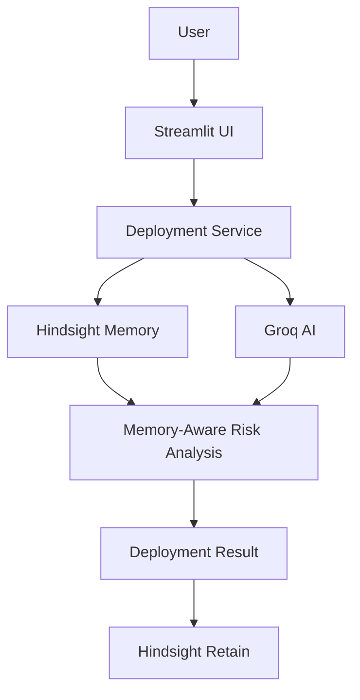

## Live Demo

https://deploymind.streamlit.app# DeployMind

DeployMind is a memory-driven deployment risk analysis assistant. Before a deployment, it recalls similar incidents from Hindsight and asks Groq to turn that evidence into targeted preventive checks. After an incident is resolved, the outcome and lesson are retained for future deployments.

## Problem

DevOps teams repeatedly encounter similar deployment problems, but the useful knowledge is scattered across logs, tickets, chat messages, and engineers' memory. A fix found during one incident is easy to lose before the next release.

## Solution

DeployMind puts deployment experiences into Hindsight persistent memory and retrieves related experiences during a later risk analysis. Recommendations distinguish current evidence from historical context and are not guarantees of deployment success or failure.

## Why Persistent Memory Matters

A stateless AI sees only the current prompt. DeployMind can retrieve previously retained deployment outcomes, root causes, and successful fixes from Hindsight, so similar changes can receive more specific checks. Streamlit session history is only for the current UI session; it is not the persistent memory layer.

## Core Features

- Memory-assisted deployment risk analysis using Groq and Hindsight.
- Recording resolved deployment experiences back into Hindsight.
- Memory Explorer for inspecting actual recall results.
- Side-by-side analysis with and without historical memory.
- Session-only deployment history and five synthetic seed experiences.

## Architecture



## Memory Workflow

**Retain:** Deployment outcome → root cause → successful fix → Hindsight.

**Recall:** New deployment → Hindsight search → similar historical experience → Groq analysis → context-aware recommendation.

## Tech Stack

Python, Streamlit, Groq, `hindsight-client`, `python-dotenv`, pandas, and pytest.

## Project Structure

```text
DeployMind/
├── app.py
├── models/deployment.py
├── services/                 # Hindsight, Groq, and deployment logic
├── utils/                    # Configuration, prompts, and UI helpers
├── scripts/seed_demo_memory.py
├── tests/
├── .env.example
├── requirements.txt
└── README.md
```

## Installation

From PowerShell in the project directory:

```powershell
python -m venv .venv
.\.venv\Scripts\Activate.ps1
python -m pip install -r requirements.txt
```

Set the environment variables listed below in your shell or local environment manager. Do not commit credentials.

## Environment Variables

```text
HINDSIGHT_API_KEY=your_hindsight_api_key
HINDSIGHT_BASE_URL=https://api.hindsight.vectorize.io
HINDSIGHT_BANK_ID=deploymind
GROQ_API_KEY=your_groq_api_key
GROQ_MODEL=openai/gpt-oss-120b
```

`GROQ_MODEL` is optional and defaults to `openai/gpt-oss-120b`. DeployMind reads configuration from process environment variables (and supports `python-dotenv` for local development); it never displays credentials.

## Running

```powershell
streamlit run app.py
```

## Seed Demo Data

```powershell
python scripts/seed_demo_memory.py
```

The script uses the real Hindsight retain API. Stable document IDs are used for the five sample deployment IDs to avoid uncontrolled duplicate seed documents.

## 60-Second Demo

1. Run the seed command and open DeployMind.
2. In **Memory Impact Demo**, analyze the Payment API / Production change to `database.yml` and `config.env`.
3. Compare the response without memory to the Hindsight-backed response. The latter should identify DEP-025 and its connection-pool failure, root cause, and successful fix when that experience is present in the configured Hindsight bank.
4. Open **Record Deployment Result** to retain an actual outcome and lesson for later analysis.

## Limitations

Memory quality depends on useful experiences being retained and available in the configured Hindsight bank. Similarity retrieval can miss relevant incidents or return imperfect matches. Groq output is advisory, can be incomplete, and must be checked by an engineer. No CI/CD system is modified or triggered by this app.

## Future Improvements

Potential integrations include GitHub Actions, Jenkins, GitLab CI, Kubernetes, Slack, and PagerDuty.
